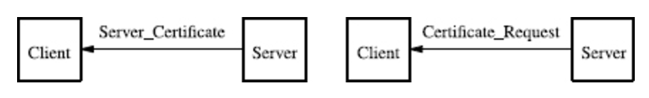
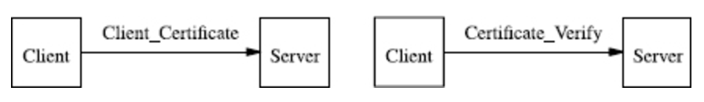
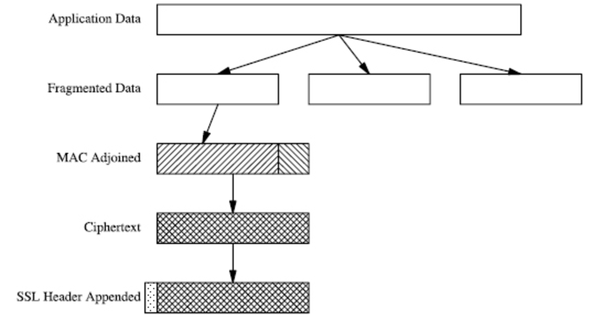

# SSL - Secure Socket Layer

* SSL 1.0 -&gt; early 1994 \(Netscape\)
* SSL 2.0 -&gt; Nov 1994
* SSL 3.0 -&gt; Nov 1996 \(Netscape\)
* TLS 1.0 -&gt; Jan 1999, based on SSL 3.0
* TLS 1.1 -&gt; Apr 2006 \(RFC4346\)
* TLS 1.2 -&gt; Aug 2008 \(RFC5246\)

**TLS - Transport Layer Security**

* Uses **Hash Message Authentication Code **instead of Message Authentication Code \(MAC\)
* Runs above layer 4 \(TCP/IP\) and below layer 5 \(HTTP, IMAP\)

SSL/TLS is based on two protocols:

1. The **Handshake Protocol** which uses public-key cryptography to establish a shared secret key between the client and the server.

2. The **Record Protocol** which uses the secret key established in the handshake protocol to protect communication between the client and the server.

## Handshake Protocol

* Client and Server agree on a key **exchange method**, an **encipherment algorithm**, and a **message digest**

#### Phase 1 - Client Initiation


Client Proposes the Following \(**Client\_Hello** payload\):

1. _Exchange Methods_:

   * RSA
   * Diffie-Hellman

2. _Data Cipher Algorithms_:

   * DES, DES3
   * AES
   * IDEA
   * RSAs RC2 and RC4

3. /Message Digest Algorithm/:

   * RSA’s MD5 \(Message Digest\)
   * NISTs SHA \(Secure Hash Algorithm\)

4. Nonce - random number \(\`random\_number\`\) \[28 bytes\]

5. A session ID \(\`SessionID\`\) \[variable length\)

6. A \(lossless\) compression method identifier \[integer 1 &lt;= C\_ID &lt;= 511\]

   * Server responds to \*Client\_Hello\* with \*Server\_Hello\*

   * Server accepts one of the choices made in the Client\_Hello method.

#### Phase 2 - Server Authentication and Key Exchange

* The server delivers its certificate
* When authentication/secrecy is enabled, there is a key exchange
* The server requests a certificate from the Client

Server Authentication and Key Exchange

Client response to server

* Client delivers its certificate an explicit verification of the server's certificate.

### SSL Record Protocol

* Provides:
  * Confidentiality \(via encryption\)
  * Authentication \(via message authentication code, MAC\)

Fragmentation, encryption, and authentication of an SSL record

* Data can be fragmented into several blocks
* Fragments can be compressed by a lossless compression algorithm
* Each compressed block is suffixed with a MAC
* Each compressed block + MAC is enciphered.
* Each enciphered block is prefixed with an SSL header.

### SSL MAC

* SSL MAC results from hash of the compression of a fragment of the application data.
  * MAC is a message digest \(fixed-length\), either MD5 or SHA

```
 hash(
        MAC_write_secret || pad_2 ||
      hash(MAC_write_secret || pad_1 || seq_num || SSLCompressed.type ||
           SSLCompressed.length || SSLCompressed.fragment)
 )
```

where:

* `hash` is either MD5 or SHA
* `||` denotes concatenation
* `MAC_write_secret` is a shared secret

* `pad_1` is the byte \`36h\` repeated:

  * 48x for MD5

  * 40x for SHA

* `pad_2` is the byte 5Ch repeated:

  * 48x for MD5

  * 40x for SHA

* `seq_num` is the 64-bit seq number for the SSL Record Protocol Message initialized to 0 and incremented up to 2^64^-1

* `SSLCompressed.type` identifies the higher layer protocol this fragment.

* `SSLCompressed.length` is the length of the compressed fragment

* `SSLCompressed.fragment` is the compressed fragment data of data \(OR plaintext if no compression is used\)

###  SSL Key Exchange

* If **RSA** is used for key exchange,
  * Client generates a \`pre\_master\_secret\` and delivers it to the server enciphered using the Server’s public RSA key, whose authenticity is attested by the Client’s X.509 Certificate.
  * The client and server process the \`pre\_master\_secret\`, deriving the keys used for the MAC and encipherment 
* If** Diffie-Hellman** is used for key exchange,
  * The client has three options:
    * **Fixed Diffie-Hellman Key Exchange** - deliver an X.509 cert to the Server containing \(p,q\) and attest to the authenticity of the Client’s Diffie-Hellman parameters.
    * **Ephemeral Diffie-Hellman Key Exchange** - the client creates one-time Diffie-Hellman parameters \(p,q\) which are delivered to the Client enciphered using the Server’s private RSA key, whose authenticity is attested to by the Client’s X.509 cert.
    * **Anonymous Diffie-Hellman Key Exchange** - the Client creates one-time Diffie-Hellman parameters \(p,q\) which are delivered to the Client without any authentication.


